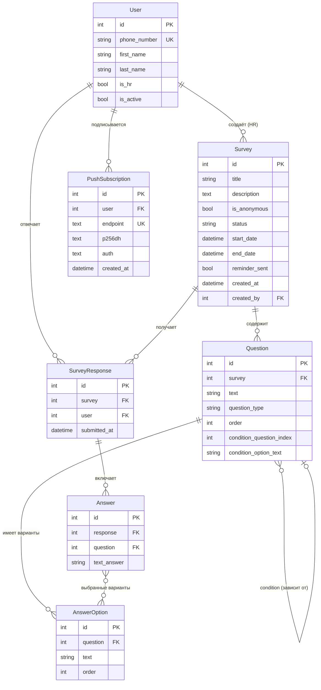

# PulseHR — Платформа для корпоративных опросов

> Инструмент HR-отдела для создания, рассылки и анализа опросов сотрудников  
> с push-уведомлениями, условной логикой вопросов и анонимным режимом.

---

## Стек технологий

### Backend — Django

| Библиотека | Версия | Роль в проекте |
|---|---|---|
| **Django** | 6.0 | Основной фреймворк, ORM, Admin-панель, управление миграциями |
| **Django REST Framework** | 3.17 | REST API: сериализаторы, ViewSet'ы, permissions |
| **SimpleJWT** | 5.5 | JWT-аутентификация (access + refresh токены, blacklist при logout) |
| **django-cors-headers** | 4.9 | CORS-заголовки для обращений фронтенда с другого origin |
| **APScheduler** | 3.11 | Фоновый планировщик: авто-активация/завершение опросов по расписанию |
| **pywebpush** | 2.3 | Отправка Web Push уведомлений через протокол VAPID |
| **whitenoise** | 6.8 | Раздача статических файлов (CSS/JS/иконки) через gunicorn в production |
| **gunicorn** | 26 | WSGI-сервер для production-деплоя |

### Frontend — Vue 3

| Технология | Роль в проекте |
|---|---|
| **Vue 3** (Composition API) | Реактивный UI, `<script setup>`, `ref`, `computed`, `watch` |
| **Vue Router** | SPA-навигация, защита маршрутов (`requiresAuth`, `guestOnly`) |
| **Pinia** | Глобальный стейт: `useAuthStore` — хранит токены, данные пользователя, `isAuthenticated` |
| **Tailwind CSS** | Утилитарные CSS-классы, адаптивный дизайн, брендовые цвета (#E8390E) |
| **shadcn-vue** | UI-компоненты: `Button`, `Input`, `Textarea`, `Label` — стилизованные через Tailwind |
| **Vite** | Сборщик, dev-сервер с HMR, proxy на Django |
| **Axios** | HTTP-клиент, перехватчики для автоматической подстановки JWT-токена |

### Инфраструктура

| Инструмент | Роль |
|---|---|
| **Docker** + **Docker Compose** | Контейнеризация backend + frontend, единая команда запуска |
| **nginx** (alpine) | Раздача статики фронтенда, reverse-proxy на Django `/api/`, `/admin/` |
| **SQLite** | База данных (персистентность через Docker volume) |
| **Web Push API** + **Service Worker** | Push-уведомления в браузере без мобильного приложения |

---

## Архитектура приложения

```
┌──────────────────────────────────────────────────────────┐
│                     Браузер пользователя                  │
│  ┌─────────────────────────┐   ┌────────────────────────┐│
│  │   Vue 3 SPA (Vite)      │   │   Service Worker       ││
│  │  Pinia │ Vue Router     │   │   (sw.js)              ││
│  │  Tailwind │ shadcn-vue  │   │   Push-уведомления     ││
│  └────────────┬────────────┘   └────────────────────────┘│
└───────────────┼──────────────────────────────────────────┘
                │ HTTP/REST (JWT)
┌───────────────▼──────────────────────────────────────────┐
│                nginx (Docker)                             │
│   /          → dist/index.html (статика Vue)             │
│   /api/      → backend:8000                              │
│   /admin/    → backend:8000                              │
└───────────────┬──────────────────────────────────────────┘
                │
┌───────────────▼──────────────────────────────────────────┐
│             Django + gunicorn (Docker)                    │
│                                                           │
│   ┌──────────┐  ┌──────────┐  ┌──────────┐  ┌────────┐  │
│   │  users   │  │ surveys  │  │  notif.  │  │analyt. │  │
│   │  API     │  │  API     │  │  API     │  │  API   │  │
│   └──────────┘  └──────────┘  └──────────┘  └────────┘  │
│                                                           │
│   ┌─────────────────────────────────────────────────┐    │
│   │  APScheduler (фоновый поток)                    │    │
│   │  каждые N сек: авто-активация/завершение опросов│    │
│   └─────────────────────────────────────────────────┘    │
│                                                           │
│   SQLite (/app/data/db.sqlite3)                          │
└──────────────────────────────────────────────────────────┘
                │ Web Push (VAPID)
        ┌───────▼───────┐
        │  FCM / Mozilla │
        │  Push Service  │
        └───────────────┘
```

---

## Блок-схема моделей данных



### Типы вопросов

| Тип | Описание | Хранение ответа |
|---|---|---|
| `single` | Один вариант из списка | `selected_options` (1 элемент) |
| `multiple` | Несколько вариантов | `selected_options` (N элементов) |
| `scale` | Шкала 1–10 | `text_answer` |
| `nps` | NPS 0–10 (критик/нейтрал/промоутер) | `text_answer` |
| `text` | Свободный ответ | `text_answer` |

---

## Функциональность

### Для сотрудников

- **Дашборд** — список активных опросов с поиском, бейджами дедлайна и статусом «✓ Пройден»
- **Прохождение опроса** — интерактивные вопросы всех типов, условная логика (вопрос появляется только при определённом ответе на предыдущий)
- **Просмотр ответов** — после прохождения можно посмотреть свои ответы (для именных опросов)
- **Push-уведомления** — браузерные уведомления о новых опросах и напоминания перед дедлайном

### Для HR

- **Управление опросами** — создание, редактирование, смена статуса (черновик → активный → завершён → архив)
- **Конструктор вопросов** — добавление вопросов любого типа, настройка вариантов ответов, условная логика
- **Дедлайны** — поля «Начало» и «Окончание» с авто-активацией и авто-завершением
- **Аналитика** — список опросов с процентом прохождения, детальные результаты по каждому ответу
- **Анонимные опросы** — режим без привязки ответов к именам сотрудников

### Автоматика (планировщик)

```
каждые N секунд (default: 30 сек в demo, 3600 сек в prod):

  1. Черновик + start_date наступил  →  статус = active  →  push всем
  2. Активный + до end_date ≤ X сек  →  push «напоминание»  →  reminder_sent = true
  3. Активный + end_date прошёл      →  статус = completed
```

---

## Анонимные опросы — как реализовано

Анонимный режим (`is_anonymous = true`) — это гарантия конфиденциальности для сотрудника: HR видит сводную аналитику, но **не знает кто конкретно что ответил**.

### Слой данных (backend)

```python
# surveys/models.py
class SurveyResponse(models.Model):
    survey = models.ForeignKey(Survey, ...)
    user   = models.ForeignKey(User, null=True, blank=True, ...)
    #                          ↑ поле есть всегда, но в аналитике скрывается
```

```python
# surveys/serializers.py — аналитика не отдаёт user для анонимных опросов
user_data = None
if not survey.is_anonymous and resp.user:
    user_data = {'id': u.id, 'name': ..., 'phone': ...}

responses.append({'id': resp.id, 'submitted_at': ..., 'user': user_data, ...})
#                                                              ↑ None для анонимных
```

```python
# surveys/serializers.py — has_responded работает для всех опросов
def get_has_responded(self, obj):
    return obj.responses.filter(user=request.user).exists()
    # user всегда сохраняется → проверка работает и для анонимных
```

### Защита от повторного прохождения

```python
# surveys/views.py
@action(detail=True, methods=['post'], url_path='respond')
def respond(self, request, pk=None):
    # Одна проверка для ВСЕХ опросов (и анонимных, и нет)
    if SurveyResponse.objects.filter(survey=survey, user=request.user).exists():
        return Response({'detail': 'Вы уже прошли этот опрос'}, status=400)
```

### Схема гарантий анонимности

```
Сотрудник отвечает на анонимный опрос
           │
           ▼
  SurveyResponse создаётся с user=request.user  (для блокировки повтора)
           │
           ├──▶ Повторный ответ?  → 400 Вы уже прошли
           │
           ▼
  HR запрашивает результаты
           │
           ▼
  analytics/views.py: if survey.is_anonymous → user_data = None
           │
           ▼
  Фронтенд получает ответы БЕЗ имён и телефонов
```

### Отображение на фронтенде

- Бейдж **«Анонимный»** (фиолетовый) в карточке и заголовке опроса
- После прохождения анонимного опроса — **не показываются** детали ответов
- Поле `has_responded` возвращает `true` → карточка помечается **«✓ Пройден»**

---

## API — основные эндпоинты

```
POST   /api/users/register/              — регистрация
POST   /api/users/login/                 — вход (возвращает access + refresh)
POST   /api/users/token/refresh/         — обновление токена

GET    /api/surveys/                     — список опросов
POST   /api/surveys/                     — создать опрос (HR)
GET    /api/surveys/{id}/                — детали опроса
PUT    /api/surveys/{id}/                — редактировать (HR)
POST   /api/surveys/{id}/respond/        — отправить ответы
GET    /api/surveys/{id}/my_response/    — мои ответы

GET    /api/analytics/results/           — сводная аналитика (HR)
GET    /api/analytics/results/{id}/      — детальные результаты (HR)

GET    /api/notifications/push/vapid-key/   — публичный VAPID ключ
POST   /api/notifications/push/subscribe/   — сохранить подписку
DELETE /api/notifications/push/unsubscribe/ — удалить подписку
```

---

## Push-уведомления — как работает

```
1. Браузер (фронтенд)
   └── регистрирует Service Worker (sw.js)
   └── вызывает PushManager.subscribe(vapidPublicKey)
   └── отправляет {endpoint, p256dh, auth} → POST /api/notifications/push/subscribe/

2. Backend сохраняет PushSubscription в БД

3. Планировщик активирует опрос (или наступает дедлайн):
   └── send_push_to_all(survey)
       └── для каждой подписки: webpush(endpoint, vapid_private_key, data)
       └── если 410 Gone → подписка удаляется из БД (браузер отписался)

4. Браузер получает push → sw.js показывает уведомление
   └── клик на уведомление → открывается /surveys/{id}
```

> **Ограничение:** Web Push требует HTTPS. На HTTP (локально или по IP) уведомления работают  
> только на `localhost`. На VPS необходим SSL-сертификат для полноценной работы.

---

## Деплой (Docker)

```bash
# Клонировать репозиторий
git clone https://github.com/KennyUfa/PulseH.git && cd PulseH

# Настроить окружение
cp .env.example .env && nano .env

# Запустить
docker compose up -d --build

# Создать суперпользователя (HR)
docker compose exec backend python manage.py createsuperuser

# Загрузить тестовые данные
docker compose exec backend python manage.py seed_demo
```

```
┌─────────────────────────────────────────────┐
│  docker-compose.yml                          │
│                                              │
│  frontend (nginx:alpine)  ──▶ :8080          │
│    └── dist/ (Vue build)                     │
│    └── proxy /api/ → backend:8000            │
│                                              │
│  backend (python:3.12-slim)                  │
│    └── gunicorn + Django                     │
│    └── APScheduler (фоновый поток)           │
│    └── volume: sqlite_data:/app/data         │
└─────────────────────────────────────────────┘
```

---

## Структура проекта

```
PulseH/
├── back/                        # Django backend
│   ├── users/                   # Аутентификация, модель User
│   ├── surveys/                 # Опросы, вопросы, ответы
│   │   └── management/commands/
│   │       └── seed_demo.py     # Команда загрузки тестовых данных
│   ├── notifications/           # Push-подписки, планировщик
│   │   ├── scheduler.py         # APScheduler: авто-активация
│   │   └── push.py              # pywebpush: отправка уведомлений
│   ├── analytics/               # Агрегированные результаты для HR
│   └── back/
│       └── settings.py          # Конфигурация, VAPID-ключи, DEBUG-режимы
│
├── front/                       # Vue 3 frontend
│   ├── public/
│   │   └── sw.js                # Service Worker (push handler)
│   └── src/
│       ├── views/               # 9 страниц приложения
│       ├── components/          # AppLayout, PushPermissionModal, shadcn UI
│       ├── stores/              # Pinia: auth store
│       ├── api/                 # Axios-обёртки: surveys, notifications
│       └── utils/push.js        # Логика подписки на push
│
├── docker-compose.yml
├── .env.example
└── requirements.txt
```
